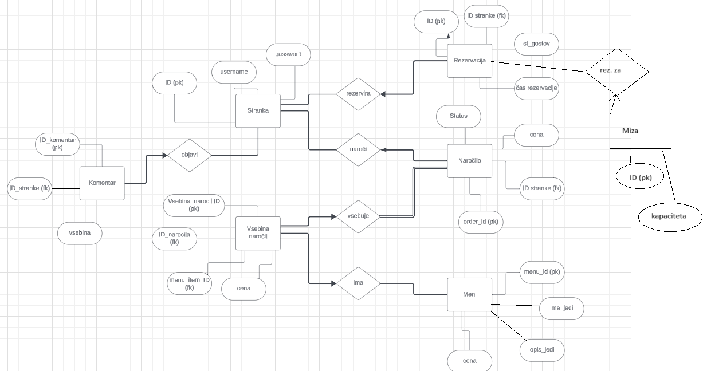

# Žarbanija

## Opis projekta

(Lačen) uporabnik se registrira oziroma prijavi. Nato izbere datum željene rezervacije in koliko ljudi misli povabiti. Rezervacije so časnovno omejene, na primer gost ne more rezervirat v preteklost. Zna se tudi zgoditi, da za njegovo izbiro datuma in število oseb ni proste mize. Po uspešni izbiri datuma in števila oseb ga aplikacija preusmeri na meni iz katerega zase in za njegove sojedce izbere jedi, ki jih mislijo pojesti. Ko potrdi jedi, dobi račun in podrobnosti rezervacije. Uporabniško izkušnjo lahko pusti v komentarjih.
 
Šef restavracije ima pregled nad vsemi (aktivnimi) rezervacijami. Prijavi se z: 
*uporabniško ime*: sef,*geslo*: sef

## ER diagram

